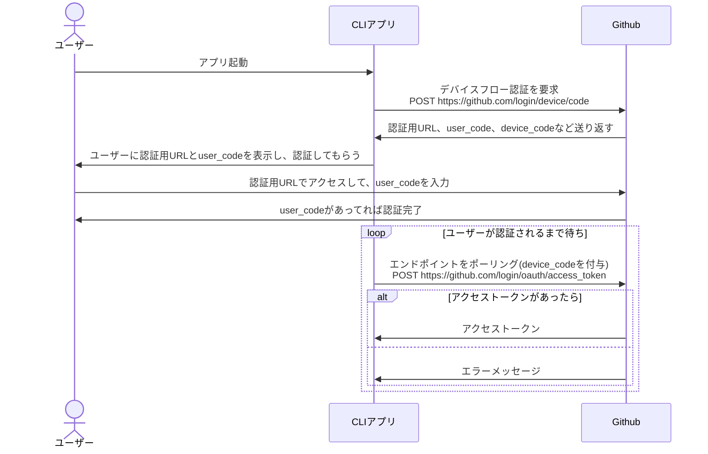

```mermaid
sequenceDiagram
  actor line_1 as ユーザー
  participant line_2 as CLIアプリ
  participant line_3 as Github
  line_1 ->> line_2: アプリ起動
  line_2 ->> line_3: デバイスフロー認証を要求<br>POST https://github.com/login/device/code
  line_3 ->> line_2: 認証用URL、user_code、device_codeなど送り返す
  line_2 ->> line_1: ユーザーに認証用URLとuser_codeを表示し、認証してもらう
  line_1 ->> line_3: 認証用URLでアクセスして、user_codeを入力
  line_3 ->> line_1: user_codeがあってれば認証完了
  loop ユーザーが認証されるまで待ち
    line_2 ->> line_3: エンドポイントをポーリング(device_codeを付与)<br>POST https://github.com/login/oauth/access_token
    alt アクセストークンがあったら
      line_3 ->> line_2: アクセストークン
    else  
      line_3 ->> line_2: エラーメッセージ
    end
  end
```